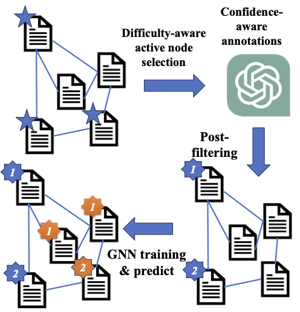

# LLMGNN

Code for our paper [Label-free Node Classification on Graphs with Large Language Models (LLMS)](https://arxiv.org/abs/2310.04668). 

## Abstract
In recent years, there have been remarkable advancements in node classification achieved by Graph Neural Networks (GNNs). However, they necessitate abundant high-quality labels to ensure promising performance. In contrast, Large Language Models (LLMs) exhibit impressive zero-shot proficiency on text-attributed graphs. Yet, they face challenges in efficiently processing structural data and suffer from high inference costs. In light of these observations, this work introduces a label-free node classification on graphs with LLMs pipeline, LLM-GNN. It amalgamates the strengths of both GNNs and LLMs while mitigating their limitations. Specifically, LLMs are leveraged to annotate a small portion of nodes and then GNNs are trained on LLMs' annotations to make predictions for the remaining large portion of nodes. The implementation of LLM-GNN faces a unique challenge: how can we actively select nodes for LLMs to annotate and consequently enhance the GNN training? How can we leverage LLMs to obtain annotations of high quality, representativeness, and diversity, thereby enhancing GNN performance with less cost? To tackle this challenge, we develop an annotation quality heuristic and leverage the confidence scores derived from LLMs to advanced node selection. Comprehensive experimental results validate the effectiveness of LLM-GNN. In particular, LLM-GNN can achieve an accuracy of 74.9% on a vast-scale dataset \products with a cost less than 1 dollar.




**NOTES:The following documentation is still under construction, I will upload some pickled intermediate results so you may get some results without querying the OpenAI API**

## Environment Setups

~~conda env create -f environment.yml --name new_environment_name~~

First,
```
pip install -r requirements.txt
```
then, I recommend installing gpu-related libraries manually (you should choose the version compatible with your GLIBC and cuda)
```
pip3 install torch torchvision torchaudio
```
and also torch-geometric according to [install](https://pytorch-geometric.readthedocs.io/en/latest/install/installation.html)
```
https://github.com/facebookresearch/faiss/blob/main/INSTALL.md
```
and finally install faiss


## About the data
### Dataset 
We have provided the processed datasets via the following [google drive link](https://drive.google.com/drive/folders/1_laNA6eSQ6M5td2LvsEp3IL9qF6BC1KV?usp=sharing)

To unzip the files, you need to
1. unzip the `small_data.zip` into `xxx/LLMGNN/data`
2. Put wikics in the same directory
3. If you want to use ogbn-products, unzip `big_data.zip` info `xxx/LLMGNN/data/new`
4. Set the corresponding path in `config.yaml`


## How to use this repo and run the code

There are two main parts of our code
1. Annotators
2. GNN training

The pipeline works as follows: 
1. `get_dataset` in `data.py`: get the pt data file, use `llm.py` to generate annotations. The indexes selected by active learning and corresponding annotations will be returned. We use the cache to store all the output annotations. `-1` is a sentinel for null annotation. 
2. `main.py`: train the GNN models. For large-scale training, we do not use the batch version, but pre-compute all intermediate results. 

To do the annotation, you need to set up your OpenAI key in the `config.yaml`. For quick try, we have uploaded some cached results to the google drive `https://drive.google.com/drive/folders/1_laNA6eSQ6M5td2LvsEp3IL9qF6BC1KV`. 

We will then go through one example for the `Cora` dataset to showcase how to use LLMGNN in practice. 

1. First, in `helper/data.py`, set the global variable `LLM_PATH` to the path of `llm.py`, which should be something like `LLM_PATH = "xxx/LLMGNN/src/llm.py"`
2. (Optional) set the global variable `PARTITIONS` to the path of the partitions used by Gpart algorithm, which should be something `PARTITIONS = "xxx/LLMGNN/data/partitions"`
3. Set the value of variable `GLOBAL_RESULT_PATH` to the path of intermediate results like clustering centers and density, which should be like `GLOBAL_RESULT_PATH = "xxx/LLMGNN/data/aax"`
4. Run the `precompute.py` to pre-compute clustering centers and density efficiently using `faiss`
5. Download `cora_openai.pt` (this is the cache file for responses from openai) and `active/cora^cache^consistency.pt` (this is the file to save annotation result) from google drive, put the former one under "\<data_path_in_config_file\>/" and the latter one under "\<data_path_in_config_file\>/active"
6. Run the following code `python3 src/main.py  --dataset cora --model_name GCN --data_format sbert --main_seed_num 3 --split active --output_intermediate 0 --no_val 1 --strategy pagerank2 --debug 1 --total_budget 140 --filter_strategy consistency --loss_type ce --second_filter conf+entropy --epochs 30 --debug_gt_label 0 --early_stop_start 150 --filter_all_wrong_labels 0 --oracle 1 --ratio 0.2 --alpha 0.33 --beta 0.33`


An example: 
```
python3 src/main.py --dataset products --model_name AdjGCN --data_format sbert --main_seed_num 1 --split active --output_intermediate 0 --no_val 1 --strategy pagerank2 --debug 1 --total_budget 940 --filter_strategy consistency --loss_type ce --second_filter conf+entropy --epochs 50 --debug_gt_label 0 --early_stop_start 150 --filter_all_wrong_labels 0 --oracle 1 --ratio 0.2 --alpha 0.33 --beta 0.33
```


## Notes
I'll optimize the code structure when I have more time ⏳.
